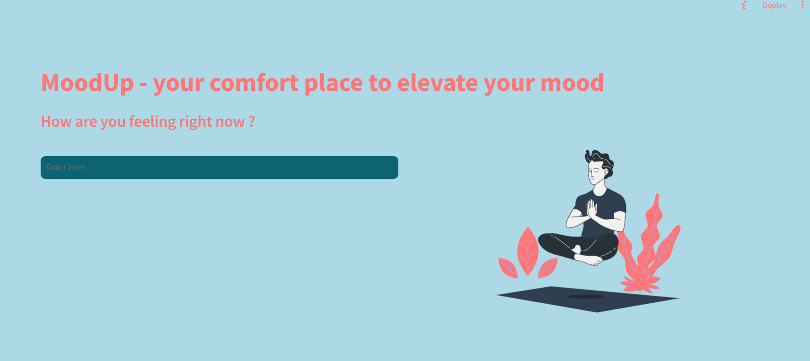
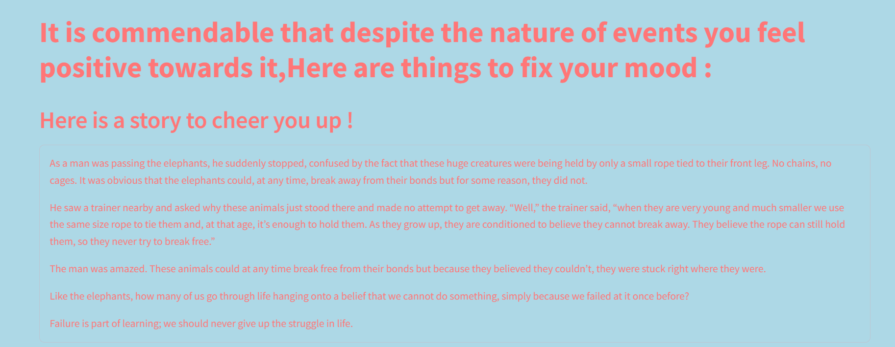

# Mental Health Analyzer







## Abstract Idea
Mental Health Analyzer is an application that helps to track user’s mental health and deal with the same. The application provides plausible solutions to the user problem which could include - stress, depression, anxiety, demotivation etc. This is achieved by a questionnaire with the user.

## Potential Features
1. Emotion classification.
2. Motivational story telling to encourage user.
3. Steps to tackle their situation like physical activities and so on.


## Tech Stacks
- **Frontend:** Streamlit
- **Backend:** Python
- **Database:** CSV preferably

## Emotions and Suggestions
1. **Happy:** Suggest cheerful music or watching funny videos.
2. **Neutral:** Encourage to explore a new hobby; motivational quotes.
3. **Sad / Depressed:** Offer comforting and empathetic stories, recommend reaching out to support, suggest engaging in comforting activities.
4. **Angry/Frustrated:** Encourage physical activities to release tension, share calming stories.
5. **Stressed:** Recommend mindfulness & meditation; take short breaks and engage in relaxing activities.
6. **Anxiety:** Share guided breathing exercise and relaxation technique.

**If Extreme:** Seek medical help, like helplines and health support.


## Installation

```
pip install -r requirements.txt 
```
### Executing
```
model.py -- Contains the machine learning model pipeline
python model.py
```
```
main.py -- Contains the streamlit framework
streamlit run main.py
```

## Explanation

[](https://www.youtube.com/watch?v=7NCwnOCZK5U)
